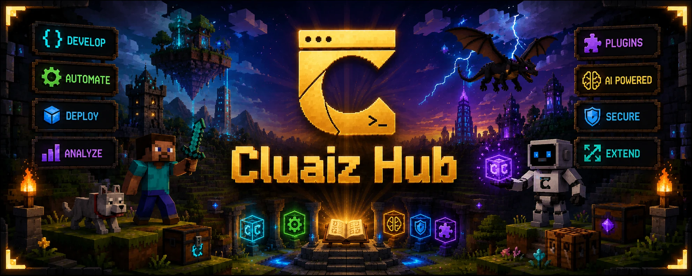

<p align="center">
  
</p>

<h1 align="center">Cluaiz Hub</h1>

<p align="center">
  <strong>The Official Registry for Cluaiz Plugins, Skills, & MCP Connectors.</strong>
</p>

<p align="center">
  <a href="https://github.com/cluaiz/cluaiz-tools/actions"></a>
  <a href="LICENSE"></a>
  
</p>

---

## Overview

**Cluaiz Hub** is the registry for the **Cluaiz Engine**. 

Instead of embedding tools into the core inference engine, Cluaiz decouples compute from capability. The host engine runs locally on user hardware to provide model inference and a multi-turn agent loop, while **Cluaiz Hub** distributes modular extensions across three categories: **Plugins**, **Skills**, and **MCP Connectors**.

---

## The Three Pillars of Cluaiz Hub

```
┌─────────────────────────────────────────────────────────────────────────────┐
│                               CLUAIZ HUB                                    │
├──────────────────────────┬──────────────────────────┬───────────────────────┤
│ 🔌 1. PLUGINS            │ 📋 2. SKILLS             │ 🌐 3. MCP CONNECTORS  │
│ (WASM & Native Binaries) │ (Task Guidance Prompts)  │ (External Bridges)    │
├──────────────────────────┼──────────────────────────┼───────────────────────┤
│ • In-process execution   │ • Declarative prompts    │ • Standard JSON-RPC   │
│ • Sandboxed WASM ABI     │ • Dynamic prefix inject  │ • Subprocess IPC      │
│ • Native C-FFI binaries  │ • Multi-turn workflows   │ • Tool auto-discovery │
│ • Fuel & RAM capped      │ • Zero-binary logic      │ • Python & Node tools │
└──────────────────────────┴──────────────────────────┴───────────────────────┘
```

### 1. 🔌 Plugins (WASM & Native Binaries)

Plugins execute deterministically inside the Cluaiz runtime without network serialization overhead:

- **WASM Plugins (`envelope: WASM`):** Sandboxed WebAssembly binaries running inside an in-process Wasmtime runtime with strict CPU instruction fuel metering and RAM caps (e.g. 16MB–64MB).
- **Native Plugins (`envelope: NATIVE`):** Dynamic libraries (`.dll`, `.so`, `.dylib`) interfacing via direct C-FFI for high-throughput database sharding and local system hooks.

### 2. 📋 Skills (Task Guidance Prompts)

Skills are structured Markdown documents (`SKILL.md`) backed by manifest definitions (`manifest-skill.yaml`). They guide the AI model on how to decompose problems, format structured queries, and interact with tools via dynamic KV-cache prefix injection.

### 3. 🌐 MCP (Model Context Protocol) Connectors

External bridges conforming to the open Model Context Protocol standard. They connect third-party tool ecosystems (such as filesystem access, version control, and live API lookups) over standard JSON-RPC 2.0 stdio transports.

---

## Execution Architecture

```mermaid
sequenceDiagram
    autonumber
    actor User as User / Application
    participant Engine as Cluaiz Engine Runtime
    participant Router as Dynamic Prefix Router
    participant Sandbox as WASM / FFI Sandbox
    participant Model as Local LLM Core

    User->>Engine: Send Task Prompt
    Engine->>Router: Probe Installed Skills & Plugins
    Router-->>Engine: Match Semantic Triggers & Inject SKILL.md
    Engine->>Model: Run Model Inference with Injected Context
    
    rect rgb(30, 45, 60)
    Note over Engine,Sandbox: Multi-Turn Autonomous Agent Loop
    Model-->>Engine: Emit Tool Directive (<TRIGGER:...> / CEL Call)
    Engine->>Sandbox: Dispatch to WASM Plugin / Native FFI / MCP
    Sandbox-->>Engine: Return Deterministic Result Pointer / JSON
    Engine->>Model: Feed Execution Result back into Active Context
    Model-->>Engine: Synthesize Next Step or Final Answer
    end

    Engine-->>User: Stream Final Output
```



---

## Official Package Catalog

All 17 packages in Cluaiz Hub are structured, validated, and ready for installation:

### 🔌 Verified Plugins (`plugins/`)

| Package Name | Envelope | Primary File | Capabilities |
| :--- | :---: | :--- | :--- |
| **`time`** | WASM | `plugins/time/src/lib.rs` | UTC timestamping, Gregorian calendar conversion, and ISO-8601 formatting. |
| **`math`** | WASM | `plugins/math/src/lib.rs` | AST recursive-descent math parser, precision arithmetic, power, and trigonometry evaluation. |
| **`text`** | WASM | `plugins/text/src/lib.rs` | SHA-256 hashing, Base64 encoding/decoding, text diff patch generation, and regex matching. |
| **`sysinfo`** | WASM | `plugins/sysinfo/src/lib.rs` | Host platform identification and telemetry probing via the Cluaiz Host ABI. |
| **`search`** | WASM | `plugins/search/src/lib.rs` | In-memory tokenization, BM25 keyword relevance scoring, and snippet extraction. |
| **`cluaizdb`** | NATIVE | `plugins/cluaizdb/native/src/lib.rs` | Multi-shard LMDB vector storage and document indexing with automatic memory governance. |
| **`web-search`** | NATIVE | `plugins/web-search/src/lib.rs` | Local multi-provider metasearch engine (Tavily, SerpAPI, DuckDuckGo) with HTML stripping. |

### 📋 Verified Skills (`skills/`)

| Skill Name | Manifest | Target Workflow |
| :--- | :--- | :--- |
| **`code-reviewer`** | `manifest-skill.yaml` | Multi-language code quality, security vulnerability analysis, and DRY enforcement. |
| **`tool-creator`** | `manifest-skill.yaml` | Scaffolding generator and validation harness for creating new Skills, Plugins, and MCPs. |
| **`spec-driven`** | `manifest-skill.yaml` | Technical specification and tradeoff analysis before code generation. |
| **`tdd-workflow`** | `manifest-skill.yaml` | Test-Driven Development protocol enforcing test verification before implementation. |
| **`learn-cluaiz`** | `manifest-skill.yaml` | Interactive onboarding tutorial and architectural breakdown of the Cluaiz ecosystem. |

### 🌐 Verified MCP Connectors (`mcp/`)

| Connector | Runtime | Command | Description |
| :--- | :---: | :--- | :--- |
| **`filesystem`** | Node / npx | `npx -y @modelcontextprotocol/server-filesystem .` | Workspace directory tree traversal and file read/write operations. |
| **`everything`** | Node / npx | `npx -y @modelcontextprotocol/server-everything` | Protocol verification test server exercising full MCP tool-calling schemas. |
| **`context7`** | Node / npx | `npx -y @upstash/context7-mcp` | Library documentation and API reference lookup engine. |
| **`fetch`** | Python / uvx | `uvx mcp-server-fetch` | Web content retrieval and HTML-to-markdown conversion bridge. |
| **`git`** | Python / uvx | `uvx mcp-server-git` | Git repository inspection, log history, and branch diff analysis bridge. |

---

## CLI Usage

```bash
# 1. Update the local registry index
cluaiz registry sync

# 2. Install a Plugin
cluaiz plugin install web-search

# 3. Install a Skill
cluaiz skill install code-reviewer

# 4. Connect an MCP Server
cluaiz mcp install filesystem

# 5. List installed packages
cluaiz list --all
```

---

## Authoring New Capabilities

To create and contribute new packages to Cluaiz Hub, follow the structural specifications in the [docs/](docs/) directory:

- **Creating a Plugin:** See [docs/plugins/](docs/plugins/) for WASM host ABI signatures and `manifest-plugin.yaml` syntax.
- **Creating a Skill:** See [docs/skills/](docs/skills/) for frontmatter schemas and context prompt guidelines.
- **Creating an MCP Bridge:** See [docs/mcp/](docs/mcp/) for subprocess configuration and transport settings.

---

## License

Cluaiz Hub packages and specifications are released under the [Apache-2.0 License](LICENSE).
