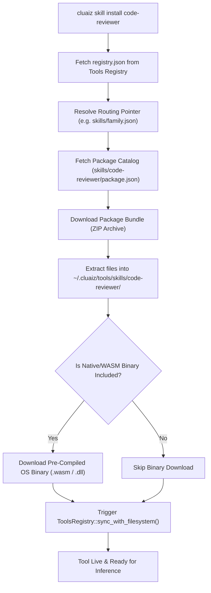

# 🗂️ Tools Registry, Filesystem Auto-Probe & Tools Ingestion

This document describes how the Cluaiz engine maintains an in-memory, zero-latency registry of all installed tools, auto-probes local disk directories on boot, and dynamically ingests packages from Cluaiz Tools.

---

## 🗃️ 1. The Registry Architecture (`ToolsRegistry`)

The central catalog of all tools is managed by `ToolsRegistry` (`engines/src/tools/registry/`):

- **Disk Persistence:** `~/.cluaiz/engine/config/tools_registry.json`
- **In-Memory Cache:** Thread-safe `HashMap<String, ToolEntry>` providing $O(1)$ lookups during inference requests.
- **Atomic Serialization:** Sealed atomically to disk upon any install, remove, or state toggle.

```rust
pub struct ToolEntry {
    pub id: String,
    pub name: String,
    pub category: String, // "skill" | "plugin" | "mcp"
    pub version: String,
    pub description: String,
    pub local_dir: String,
    pub binary_path: Option<String>,
    pub enabled: bool,
    pub execution_mode: ExecutionMode, // Auto | Manual
    pub default_turns: i32,
    pub permissions: Vec<String>,
    pub semantic_triggers: Vec<String>,
    pub activation_events: Vec<String>,
}
```

---

## 🔍 2. Boot-Time Filesystem Auto-Probing (`sync_with_filesystem`)

Whenever the engine boots or installs a new component, `ToolsRegistry::sync_with_filesystem` executes a comprehensive scan of the 3 local directories:

```
~/.cluaiz/tools/
├── skills/   ──> Scanned for SKILL.md and package.json
├── plugins/  ──> Scanned for logic.wasm / binaries and package.json
└── mcp/      ──> Scanned for package.json
```

### Probing Steps:
1. **Purge Dangling Entries:** If a directory listed in `tools_registry.json` was deleted manually from disk, the entry is automatically purged from the registry.
2. **Metadata Extraction:**
   - **Skills:** `probe_skill_frontmatter` parses YAML frontmatter in `SKILL.md` or `package.json`.
   - **Plugins:** `probe_plugin_metadata` parses `package.json` and links the `.wasm`/`.dll` binary.
   - **MCPs:** `probe_mcp_metadata` parses `package.json` and extracts commands and arguments.
3. **Atomic Save:** The updated catalog is written back to `tools_registry.json`.

---

## 🚀 3. Cluaiz Tools Package Ingestion (`ToolsInstaller`)

When a developer installs a package via `cluaiz <category> install <name>`, the `ToolsInstaller` executes the following secure pipeline:



---

## 🧠 4. Dynamic Semantic Trigger Matching (`SkillRouter`)

During chat sessions, the engine does NOT dump all skill prompts into the context window (which wastes VRAM and slows down attention). Instead:

1. **Fast Keyword & Embedding Matching:** `SkillRouter::match_query` matches the user prompt against `discovery.semantic_triggers` in $O(1)$ time.
2. **Prefix Caching & Dynamic Context Injection:** Only the matched `SKILL.md` prompt body is injected into the active turn context, preserving cached token prefixes.
3. **Turn Purge:** Once the turn completes, the prompt is purged, keeping KV-cache lightweight and fast.
