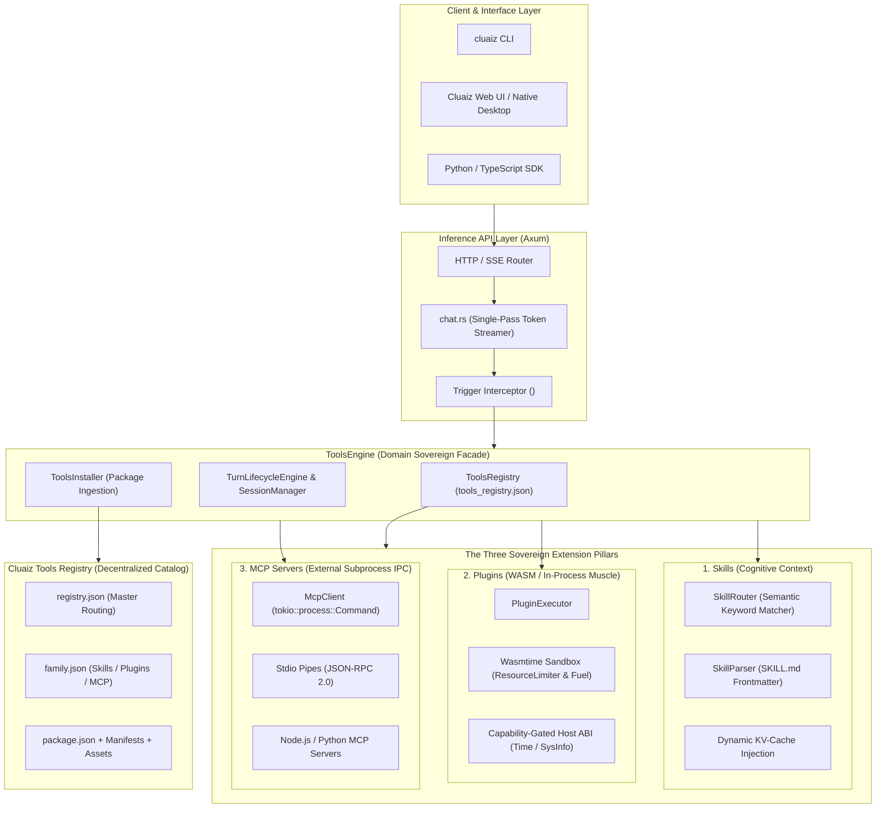

# 🏗️ Cluaiz End-to-End System Architecture

This document defines the high-level architecture of the Cluaiz ecosystem, detailing the sovereign boundaries between the core Rust Inference Engine (`cluaiz`) and the decentralized extension registry (`cluaiz-tools`).

---

## 🌐 1. High-Level Architecture Topology



---

## 🧩 2. The Three Sovereign Extension Pillars

The Cluaiz engine establishes a strict architectural separation between **Cognition (Prompts)**, **In-Process Compute (WASM)**, and **External Subprocesses (MCP)**:

| Architectural Dimension | 🧠 1. Skills | ⚡ 2. Plugins | 🔌 3. MCP Servers |
|---|---|---|---|
| **Primary Domain** | Cognitive framing, reasoning frameworks, domain rules | Deterministic mathematical calculation, regex, local indexing | Filesystem access, Git operations, remote databases |
| **Execution Medium** | Dynamically injected into LLM System Prompt (KV-Cache) | Executed in-process via Wasmtime isolated sandbox | Executed in external child processes communicating via Stdio |
| **Package Spec** | `package.json` + `SKILL.md` | `package.json` + `logic.wasm` | `package.json` (stdio subprocess) |
| **Performance Overhead** | Zero runtime compute overhead (pure prompt tokens) | **Sub-millisecond (~1ms)** in-process latency | Process IPC overhead (~10–50ms) |
| **Safety & Security** | Sandboxed by LLM attention budget | Strict memory caps (`ResourceLimiter`) + CPU fuel limits | Host process isolation with explicit argument whitelisting |
| **Network & OS Access** | None (Zero ambient authority) | None by default; capability-gated via Host ABI | Declared explicitly in manifest |

---

## 🔒 3. Security, Sandboxing & Zero Ambient Authority

Every tool executed by Cluaiz conforms to the **Zero Ambient Authority** doctrine:

1. **WASM Micro-Sandboxing (`inference-cel`):**
   - Plugins execute inside isolated `wasmtime` instances.
   - **RAM Enforcement:** Hard physical memory caps enforced at the WebAssembly page-growth level via Rust `wasmtime::ResourceLimiter`.
   - **Fuel Limits:** Instruction counters injected into WebAssembly bytecode prevent infinite loops or CPU exhaustion.
   - **Host ABI Gating:** System clock (`cluaiz:now_utc_ms`) and platform telemetry (`cluaiz:os_platform`) are explicitly linked only when declared in the plugin's manifest permissions.

2. **MCP Subprocess Isolation (`engines/src/tools/mcp/client.rs`):**
   - External servers are spawned as isolated child processes via `tokio::process::Command`.
   - Stdio pipes are strictly bounded with 30-second asynchronous timeout guards.
   - Child processes are automatically reaped on session drop to prevent zombie processes.

---

## 🌐 4. Tools Ingestion & Synchronization Flow

```
1. Developer publishes package to Cluaiz Tools (registry.json -> family.json -> package.json)
2. User runs `cluaiz <skill|plugin|mcp> install <name>`
3. ToolsInstaller downloads package bundle, verifies SHA-256 hash, and extracts files
4. ToolsRegistry::sync_with_filesystem() auto-probes local directory and updates tools_registry.json
5. Engine activates tool instantly with ZERO server restarts required
```
