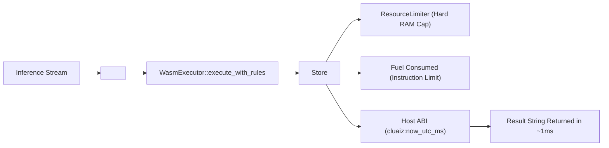

# ⚡ Plugins: In-Process Sandboxed Execution Muscle

In Cluaiz, **Plugins** provide the raw **Computational Muscle**. While Skills inject cognitive context, Plugins execute deterministic compiled logic (WASM or Native binaries) in-process at sub-millisecond speeds.

---

## 🎯 1. What is a Plugin?

A Plugin is an execution unit containing:
- **`package.json`**: Cluaiz Tools single-source registry and dependency index.
- **Compiled Binary (`logic.wasm` or `.dll`/`.so`)**: Compiled bytecode implementing the Cluaiz C-ABI.
- **`assets/icon.svg`**: Vector SVG icon for UI.

```
plugins/my-plugin/
├── package.json          ← Tools registry packaging & OS binaries
├── logic.wasm            ← Compiled WASM bytecode
└── assets/
    └── icon.svg          ← Vector UI icon
```

---

## 🔒 2. Sandboxing Architecture (Wasmtime)

Plugins are executed via `inference_cel::WasmExecutor` with strict security enforcement:



### Security Guarantees:
1. **Zero Ambient Authority:** A WASM plugin cannot access the host filesystem, network sockets, or environment variables unless explicitly granted.
2. **Deterministic Execution:** Eliminates LLM calculation flaws (e.g. arithmetic errors, string parsing mistakes).
3. **Hard Memory Caps:** Physical RAM is managed via `wasmtime::ResourceLimiter`.
4. **Fuel Limits:** CPU instructions are counted to prevent infinite execution loops.
