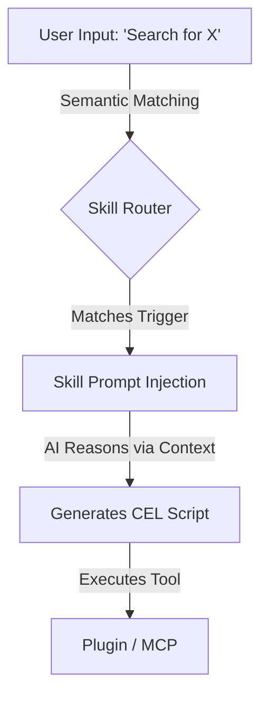

# 1. Create Your First AI Skill

In Cluaiz, **Skills** represent the "Brain" of the operation. While Plugins and MCPs provide the raw computational muscle, a Skill provides the neural context and step-by-step instructions (prompts) to tell the AI *how* and *when* to use those muscles.

---

## The Skill Architecture

A Skill does not contain executable binary code. Instead, it contains highly structured system prompts and trigger conditions.



## Step 1: The Package Specification (`package.json`)

Create a `package.json`. This file tells the engine what capabilities the skill has and what underlying dependencies (muscle) it requires to function:

```json
{
  "id": "research-assistant",
  "name": "Research Assistant",
  "category": "research",
  "hub_type": "skill",
  "logo": "/assets/icon.svg",
  "title": "Deep Web Research Protocol",
  "description": "Equips the AI with the ability to perform deep web research using the search plugin.",
  "author": {
    "name": "Cluaiz Engineers",
    "url": "https://github.com/cluaiz"
  },
  "license": "Apache-2.0",
  "dependencies": {
    "plugins": {
      "cluaiz-search": {
        "version": "^0.1.1",
        "url": "https://raw.githubusercontent.com/cluaiz/cluaiz-tools/main/plugins/web-search/package.json"
      }
    },
    "mcp": {},
    "skills": {}
  },
  "latest_version": "1.0.0",
  "versions": {
    "1.0.0": {
      "updated_at": "2026-07-01T12:00:00Z",
      "files": {
        "skill": "/SKILL.md",
        "icon": "/assets/icon.svg"
      }
    }
  }
}
```

## Step 2: The `SKILL.md` File

Every skill must have a Markdown file (`SKILL.md`) containing the precise system instructions for the LLM. 

When the user triggers the skill, the Engine dynamically injects the contents of `SKILL.md` into the active inference context window:

```markdown
---
id: cluaiz.skill.research-assistant
name: research-assistant
triggers:
  semantic:
    - "research"
    - "search the web"
    - "look up"
---

# Deep Web Research Protocol

You are an expert researcher. When the user asks you to find information, you MUST adhere to the following protocol:

1. **Analyze the Request:** Break down the user's query into 2-3 core search terms.
2. **Execute Search:** Call the `cluaiz-search` plugin via CEL.
3. **Synthesize Findings:** Aggregate facts and cite your sources.
```
